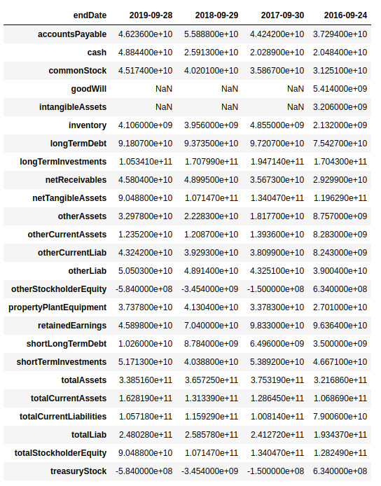
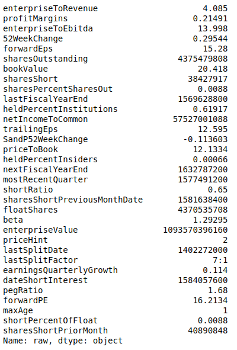
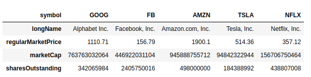

## Get company financial with Yahoo Finance

This is a simple script to extract fundamental data from yahoo finance company page.

## Usage
### Get Financial Statements
`bs_, is_, cf_ = get_fundamentals('AAPL')`

The function above returns 3 pandas `dataframes` that look like this

### Get Key Statistics
`key_stat = get_keystats('AAPL)`. The output looks like this

## Get Competitors

`peers = get_comeptitors`. The output looks like this

