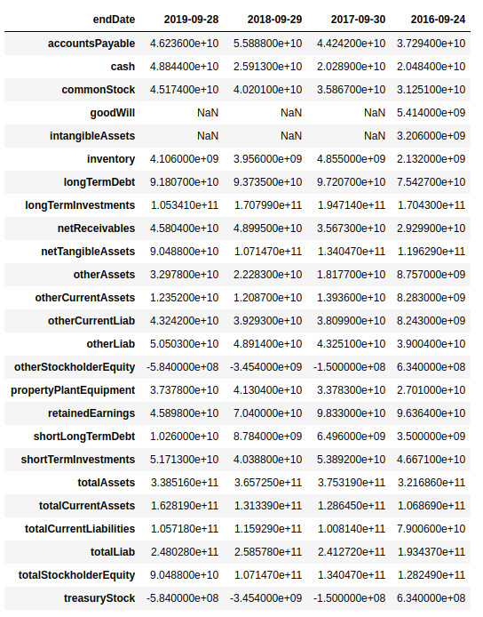

## Get company financial with Yahoo Finance

This is a simple script to extract fundamental data from yahoo finance company page.

## Usage
`bs_, is_, cf_ = get_fundamentals('AAPL')`

The function above returns 3 pandas `dataframes` that look like this

